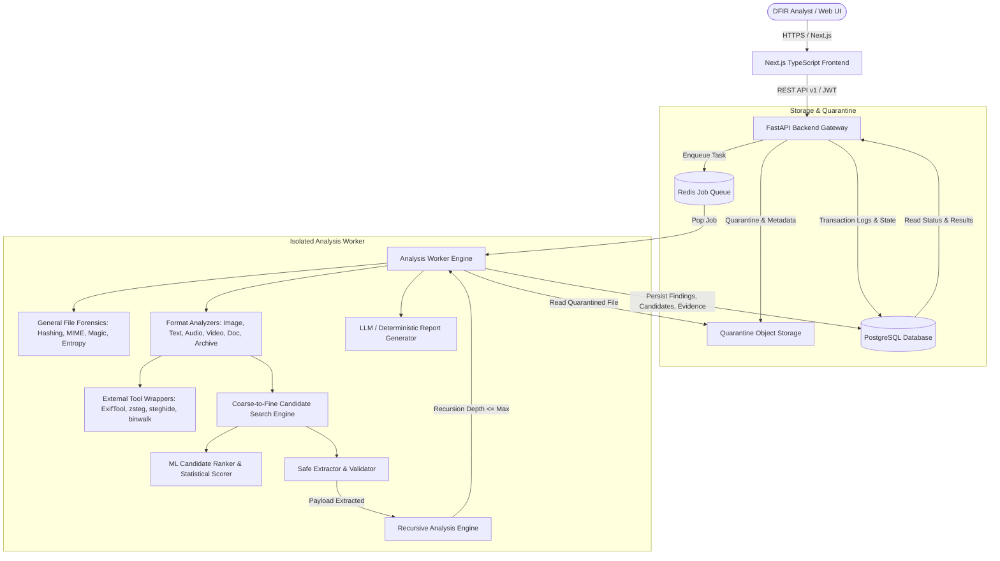
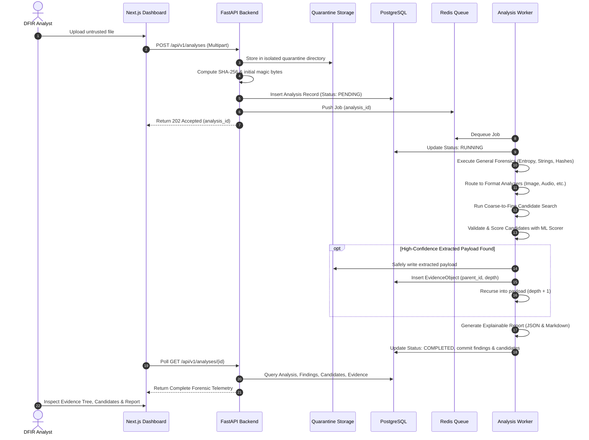

# Architecture Specification: StegoSentinel

## 1. Executive Summary & Vision

**StegoSentinel** is an enterprise-grade, defensible digital forensics and steganalysis platform designed for incident responders, digital forensics and incident response (DFIR) analysts, and threat intelligence researchers. It systematically inspects untrusted files across multiple data formats (images, documents, text, archives, audio, video), detects subtle statistical and structural anomalies indicative of steganography or covert channels, explores and ranks extraction hypotheses through a coarse-to-fine candidate search engine, safely extracts embedded payloads without execution, recursively analyzes extracted evidence, and compiles an explainable, auditable forensic report.

---

## 2. Core Forensic Principles & Guardrails

1. **Zero Trust File Handling**: Every uploaded file and every extracted artifact is untrusted. No payload is ever executed under normal product workflows.
2. **Defensible Terminology**:
   - Never claim a file "contains no hidden data" because tests did not find indicators.
   - Use calibrated probability phrases: *"Steganography likelihood: 78%"* rather than *"Steganography confirmed"*.
   - Distinguish *detection* (presence of anomaly), *extraction* (retrieval of bitstream), *identification* (typing payload), *decoding* (interpreting structured data), and *maliciousness assessment* (threat correlation).
3. **Deterministic Evidence Priority**: Deterministic structural and statistical analysis forms the primary ground truth. Machine learning provides candidate ranking and anomaly scoring; LLMs serve exclusively as explanation, correlation, and summary assistants.
4. **Reproducibility & Auditability**: Every finding, candidate, and extracted object stores its exact extraction parameters, analyzer versions, model versions, and timestamps.
5. **Fail-Safe Resource Limits**: Hard budgets on file sizes, recursion depth, candidate generation, memory, and CPU guard against decompression bombs and algorithmic denial of service.

---

## 3. High-Level System Architecture

---

## 4. Key Architectural Components

### 4.1 Frontend (`frontend/`)
- **Framework**: Next.js 14+ (App Router) with TypeScript.
- **Design System**: Dark-mode forensic telemetry aesthetic (deep slate, cyan/indigo accents, crisp data density).
- **Core Views**:
  - `/dashboard`: System health, recent analyses, queue statistics, threat indicators.
  - `/upload`: Secure drag-and-drop file upload with client-side hash pre-check and MIME classification.
  - `/analysis/[id]`: Live progress tracking, multi-layer findings, anomaly metrics, and candidate ranking.
  - `/evidence/[id]`: Interactive hierarchical evidence tree displaying recursively extracted objects and child artifacts.
  - `/reports/[id]`: Formatted forensic report viewer with Markdown export, JSON export, and print/PDF support.
  - `/settings`: Engine configurations, worker budgets, tool availability matrix, and API keys.

### 4.2 Backend API (`backend/app/api/`)
- **Framework**: FastAPI (Python 3.11+).
- **Core Responsibilities**:
  - Secure upload handling and quarantine allocation.
  - Authentication (JWT), RBAC (Admin, Analyst, Viewer), and tenancy/IDOR validation.
  - RESTful versioned endpoints (`/api/v1/...`).
  - Job dispatch to Redis message broker.
  - Report rendering (JSON, Markdown, PDF).

### 4.3 Asynchronous Worker Engine (`worker/`)
- **Queue**: Redis list / stream.
- **Execution Model**: Sandboxed process with strict memory/CPU/timeout limits.
- **Isolation**: Non-root container execution, read-only root FS, ephemeral quarantine tmpfs.

### 4.4 Forensic Analyzers (`backend/app/analyzers/`)
1. **General Forensics (`general.py`)**:
   - SHA-256, SHA-512, MD5 hashes.
   - Magic byte verification (`python-magic` / pure-python fallback table).
   - Filename extension mismatch detection.
   - Shannon entropy calculation per 256-byte window and overall.
   - Printable ASCII/UTF-8 ratio and suspicious string scanning (URLs, IPs, PowerShell, shell indicators).
   - File trailing/appended data detection (e.g. data after JPEG EOI `FF D9`, PNG IEND, or ZIP Central Directory).
2. **Image Steganalysis (`image.py`)**:
   - Support: PNG, BMP, JPEG, GIF, TIFF.
   - Channel isolation: R, G, B, A, Luminance (Y), Chrominance (Cb, Cr).
   - Bit-plane analysis (planes 0 through 7).
   - LSB spatial analysis: Chi-square test, sample pair analysis, bit flips, and randomness distribution.
   - Structural anomaly checks: Invalid chunk CRC, non-standard ancillary chunks, trailing overlays.
   - Tool integrations: `zsteg`, `steghide`, `exiftool`, `binwalk` with schema normalization and fallback.
3. **Text Steganalysis (`text.py`)**:
   - Unicode anomaly inspection: Zero-width spaces (`U+200B`), non-breaking spaces, zero-width non-joiners (`U+200C`, `U+200D`), directional markers (`U+202E`, `U+202D`).
   - Trailing and inter-sentence whitespace patterns (Snow-style stego).
   - Homoglyph detection (Cyrillic/Latin cross-script confusables).
   - Base64, Hexadecimal, and high-entropy substring detection.
4. **Archive Forensics (`archive.py`)**:
   - Formats: ZIP (extensible to TAR, 7z).
   - Zip Bomb & Decompression limits: Max total size (e.g., 250MB), max file count (e.g., 50 files), max ratio (e.g., 100:1).
   - Path Traversal Shield: Rejects `../`, absolute paths `/etc/...`, and null-bytes.
   - Symlink and hardlink neutralization: Refuses to extract or follow symlinks.
5. **Audio Forensics (`audio.py`)**:
   - WAV PCM parser: RIFF header validation, sample rate, bit depth, channel analysis.
   - LSB extraction on 8-bit, 16-bit, and 24-bit audio samples.
   - Amplitude distribution and high-frequency noise floor analysis.
6. **Document Forensics (`document.py`)**:
   - PDF: Object tree traversal, suspicious stream analysis, `/JavaScript`, `/Launch`, `/EmbeddedFiles`, `/URI` detection.
   - Office (DOCX/XLSX/PPTX): ZIP package inspection, `[Content_Types].xml`, `_rels`, VBA macro streams (`vbaProject.bin`), external template injection.

### 4.5 Candidate Generation & Extraction Engine (`backend/app/candidates/`)
- **Coarse-to-Fine Search Space**:
  - *Phase 1: Coarse Screening*: Rapid entropy and chi-square check on bit-planes.
  - *Phase 2: Permutation Generation*: Channel combinations (R, G, B, RGB, BGR, RGBA), bit planes (0, 1), traversal orders (row-major, column-major, zigzag), strides (1, 2, 4), bit alignment (LSB-first, MSB-first).
  - *Phase 3: Extraction & Candidate Validation*: Extract sample stream, test against magic bytes, UTF-8 validity, language trigrams, and compression headers.
  - *Phase 4: ML Candidate Ranking*: Score candidate validity using pre-trained tabular model.
  - *Phase 5: Full Extraction & Recursive Ingestion*: Top valid candidates are saved as new `EvidenceObject` records and passed to recursive analysis.

### 4.6 Recursive Analysis Engine (`backend/app/extraction/recursion.py`)
- Tracks parent-child relationships via `parent_id` in `EvidenceObject`.
- Enforces hard recursion limits: Max depth = 3, Max total objects = 20.
- Re-identifies each extracted payload through the General Forensics pipeline, preventing infinite loop bombs.

### 4.7 AI / ML Layer (`backend/app/ai/`)
1. **ML Candidate Ranker (`scorer.py`)**:
   - Interpretable tabular classifier (RandomForest / Logistic Regression) trained on synthetic forensic feature vectors:
     - Shannon entropy, printable ratio, magic byte match, z-score chi-square, byte repetition rate, language trigram score.
   - Emits: Probability score (0.00 to 1.00), feature importances, and calibrated confidence.
2. **LLM Explanation & Reporting Layer (`llm/`)**:
   - Decoupled `LLMProvider` interface with `MockLLMProvider` for tests/offline, and `OpenAIProvider` / `GenericHTTPProvider` for live environments.
   - Prompt Injection Shield: All evidence is wrapped in strict `<UNTRUSTED_EVIDENCE>` delimiters with explicit meta-instructions prohibiting code execution or instruction following.

---

## 5. Data Flow Diagram

---

## 6. Threat Model & Security Boundaries

| Boundary | Threat Vector | Mitigation Strategy |
|---|---|---|
| **Boundary 1: Upload Intake** | Malicious filename, Path traversal, Oversized file | Sanitized UUID filenames, strict size limits (100MB), quarantine isolation |
| **Boundary 2: Worker Engine** | Parser exploits (ImageMagick/libpng bugs), Command injection | Sandboxed container, non-root user, no shell execution, strict input sanitization |
| **Boundary 3: Archive Extraction**| Zip bomb, directory traversal (`../../etc/passwd`) | Pre-extraction zip header inspection, strict total size limit, absolute path blocking |
| **Boundary 4: Payload Handling** | Auto-execution of executable (EXE/ELF/sh) | Strictly passive inspection, no exec bit, never invoked via interpreter |
| **Boundary 5: AI / LLM Layer** | Indirect prompt injection in embedded text | Strict delimiter sandboxing, instruction refusal, mock provider default |
| **Boundary 6: API Layer** | IDOR/BOLA, unauthorized access, SQLi | Parameterized SQLAlchemy ORM, tenant/user ownership checks on all IDs, JWT auth |

---

## 7. Storage Abstraction

All file interactions go through `StorageBackend`:
- `LocalStorageBackend`: Ephemeral quarantine filesystem with hashed directories (`/quarantine/{sha256[:2]}/{sha256}`).
- `S3StorageBackend` (interface ready): For production multi-worker environments using MinIO or AWS S3.
